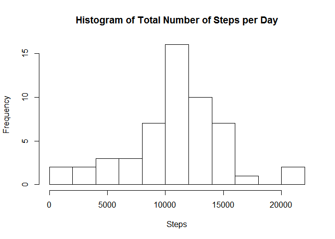

# Reproducible Research: Peer Assessment 1
Gareth Houk  
Thursday, October 16, 2014  
This document is produced using R Markdown for Project 1 of the Reproducible Research course.

The assignment's description of the dataset is as follows.

It is now possible to collect a large amount of data about personal movement using activity monitoring devices such as a Fitbit, Nike Fuelband, or Jawbone Up. These type of devices are part of the "quantified self" movement -- a group of enthusiasts who take measurements about themselves regularly to improve their health, to find patterns in their behavior, or because they are tech geeks. But these data remain under-utilized both because the raw data are hard to obtain and there is a lack of statistical methods and software for processing and interpreting the data.

This assignment makes use of data from a personal activity monitoring device. This device collects data at 5 minute intervals through out the day. The data consists of two months of data from an anonymous individual collected during the months of October and November, 2012 and include the number of steps taken in 5 minute intervals each day.


## Loading and preprocessing the data

The following code assumes that either the zip file or the extracted data file exists in the working directory.  It reads it in then creates useful time variables from the interval variable.


```r
        csvfile <- "activity.csv"
        if (!file.exists(csvfile)) {
                zipfile <- "repdata_data_activity.zip"
                if (!file.exists(zipfile)) {
                        stop("Cannot find data files")
                } else {
                        unzip(zipfile)
                        if (!file.exists(csvfile)) {stop("Unzip Error")}
                }
        }
        # Load the data (i.e. read.csv())
        data <- read.csv(csvfile)
        # Process/transform the data (if necessary) into a format suitable for your analysis
        # Get dates into better format
        min<-as.character(data$interval%%100)
        hr <-as.character(floor(data$interval/100))
        hrmin <- paste(sep=":",hr,min,"00")
        data$min <-min
        data$hr  <-hr
        data$time<-as.POSIXct(paste(as.character(data$date),hrmin))
```

## What is mean total number of steps taken per day?

The following R code make a histogram of the total number of steps taken each day and calculates and reports the mean and median total number of steps taken per day.


```r
        # histogram and mean total number of steps each day
        total.by.day<-tapply(data$steps,data$date,FUN=sum)
        hist(total.by.day,breaks=10,
             main="Histogram of Total Number of Steps per Day",xlab="Steps",ylab="Frequency")
```

 

```r
        meanstep  <-mean(total.by.day,na.rm=TRUE)
        medianstep<-median(total.by.day,na.rm=TRUE)
```

The mean number of steps per day is 10766.19 and the median number of steps is 10765.

## What is the average daily activity pattern?


## Imputing missing values


## Are there differences in activity patterns between weekdays and weekends?


